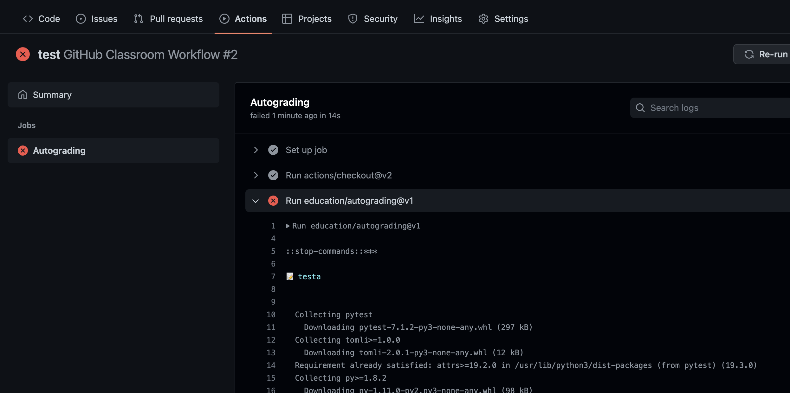

# GitHub Classroom

We use [GitHub classroom](https://classroom.github.com/) to manage the working progress. After joining the classroom, you're able to have your own working repository and the CI will running the test scripts on your commits.

This document talks about the classroom usage.

## Join the Classroom

There is an invitation link for classroom, they look like `https://classroom.github.com/a/qrafXMQF`, visit the invitation link from manager.

**We'll give you the latest links before the course starts.**


## Autograding

Autograding is a workflow which can automatically run test cases. However there are some limitations in Github classroom, in order to run it in our self-hosted machines, **you need to commit it**.

When you have completed the course assignments and have obtained the results, type the following command on the command line:

```sh
git add .github
git commit -m "complete the labx"
git push
```

## Commit Your Work

Now you're able to work on your local copy. Once you are ready to try with CI(feel free to use CI), commit your changes and push them to your `master` branch.

There is a symbol on the right of your work, in the image, yellow point means the CI is on going, just the "Details" to check out the output of CI.


Here we can see if our submitted code passes the test


If the tests we submitted report errors, we can click to see the errors.

Also, if we pass all the tests, one can see the result of our happy ending. 🎉

